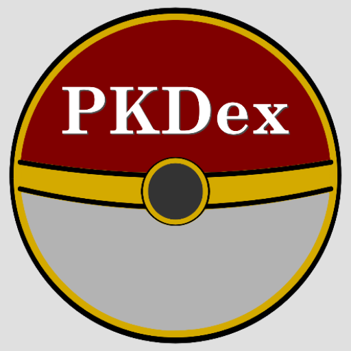

<h1 align="center">Pokedex</h1>
<h4 align="center">It´s a pokedex... cool! right! :D</h4>

## Description

This pokedex app uses the pokeapi to get the data of all existing pokemons, they are a lot, and you can get their info with just a few clicks!
Complete with: search options (by name or id), dark and light mode  

## Technical Specifications
* Coded using **Kotlin**
* The UI was made using **Jetpack Compose**
* Consumes the **PokeApi** using **Retrofit2**
* Architecture **MVVM + Clean**
* Dependency injection framework **Dagger Hilt**
* Uses **Material Design 3**
* Custom app Icon and vector images were made using **Inkscape**

## Screenshots
 
<h3 align="center">Home screen</h3>
 

 
 

 
<h3 align="center">Details screen (light mode)</h3>
 

 
 

 
<h3 align="center">Details screen (dark mode)</h3>
  

 
 

